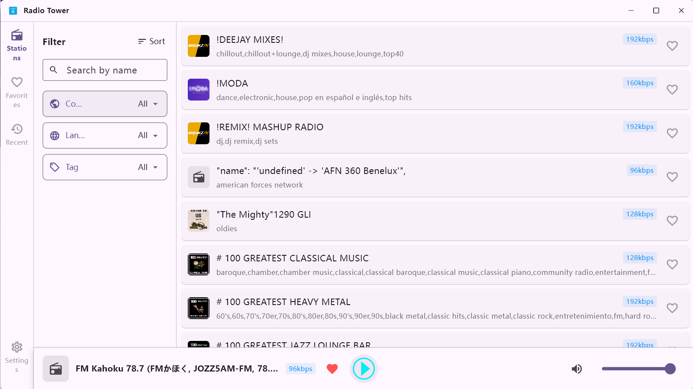

# Radio Tower

[简体中文](docs/README.zh-CN.md)

**Radio Tower** is an online radio player built with Flutter. On its first
launch, it downloads the complete station catalog, which can take several
minutes depending on your network connection.

## Features

- Search stations by name
- Filter stations by country, language, and tag
- Save favorite stations and view listening history
- Minimize the app to the system tray

## Supported Platform

- Windows

## Main Interface



## Station Data

Radio Tower uses station data from:

- [Radio Browser](https://www.radio-browser.info/)

## Privacy

- The source code contains no account system, analytics or telemetry SDKs, or
  self-hosted backend. The app does not collect personal information.
- When you play a station, the Radio Browser servers, your network provider,
  and the station's streaming server may receive your network information.

## Development

Prerequisites:

- Flutter SDK 3.44 or later
- The Visual Studio C++ toolchain required for Flutter Windows development

To run the project locally:

```bash
flutter pub get
flutter run -d windows
```

To run tests or build a release package:

```bash
flutter test
flutter build windows
```

## Contributing

Bug reports, suggestions, and documentation improvements are welcome through
[Issues](https://github.com/pinellia-gg/radio-tower/issues).

## License

This project is released under the [MIT License](LICENSE).
