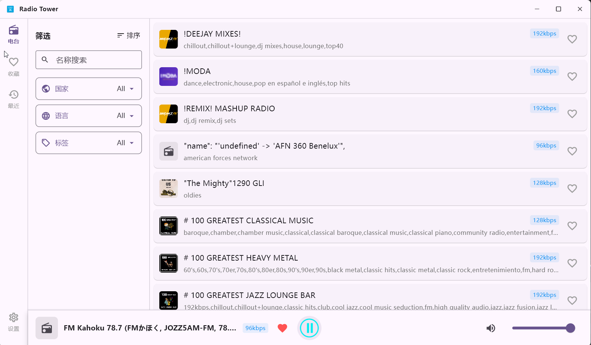

[English](../README.md) 

# Radio Tower

**Radio Tower**是一款在线电台播放软件，基于flutter开发。首次启动时，会全量下载电台数据信息，可能会需要几分钟（取决于你的网络状况）。

**功能特性：**
- 支持名称搜索
- 支持按国家、语言、标签筛选
- 支持电台收藏、播放历史
- 支持最小化到系统托盘

## 支持平台
- windows

## 主界面

## 电台数据：
本软件使用以下来源的电台数据：
- [Radio Browser](https://www.radio-browser.info/)

## 隐私说明
- 当前代码没有账号系统、分析遥测SDK，也没有自建服务端，本软件不会收集你的隐私信息
- 当播放电台时，Radio Browser数据源服务器、网络服务商、电台源站可能获取到你的网络信息

## 开发
开发环境：
- Flutter SDK 3.44 或更高版本。
- Flutter Windows开发环境所需的Visual Studio C++工具链。

## 贡献

欢迎通过 [Issues](https://github.com/pinellia-gg/radio-tower/issues) 提交 Bug、建议或文档修正。

## 许可证

本项目采用 [MIT License](LICENSE) 开源。
